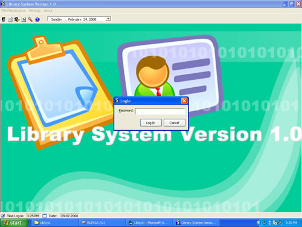

## LIBRARY AND INVENTORY SYSTEM 1\.0\.0 USING ADODC, ADODB

### Description

This system will help you to use a listview as a grid in vb6.0 it uses a ms access were the data to store... It is easiest way to learn a adodb and adodc or a ado....... using a hard code for you.
 
### More Info
 

             |
---                |---
**Submitted On**   |2008-02-25 17:58:40
**By**             |[ralph f\. leyga](https://github.com/Planet-Source-Code/PSCIndex/blob/master/ByAuthor/ralph-f-leyga.md)
**Level**          |Intermediate
**User Rating**    |4.8 (24 globes from 5 users)
**Compatibility**  |VB 3\.0, VB 4\.0 \(16\-bit\), VB 5\.0, VB 6\.0
**Category**       |[Databases/ Data Access/ DAO/ ADO](https://github.com/Planet-Source-Code/PSCIndex/blob/master/ByCategory/databases-data-access-dao-ado__1-6.md)
**World**          |[Visual Basic](https://github.com/Planet-Source-Code/PSCIndex/blob/master/ByWorld/visual-basic.md)
**Archive File**   |[LIBRARY\_AN212571932008\.zip](https://github.com/Planet-Source-Code/ralph-f-leyga-library-and-inventory-system-1-0-0-using-adodc-adodb__1-71046/archive/master.zip)

### API Declarations

This system will help you to use a listview as a grid in vb6.0 it uses a ms access were the data to store... It is easiest way to learn a adodb and adodc or a ado....... using a hard code for you.

